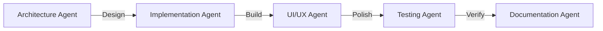
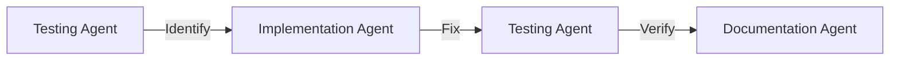
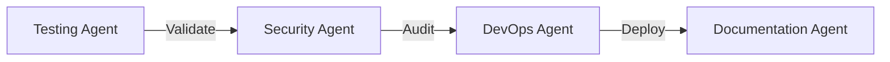

# 🤖 AI AGENTS USAGE GUIDE - Specialized Agents for ROCQET

## Overview

This guide describes specialized AI agents and when to use them for maximum efficiency. Each agent is optimized for specific tasks.

---

## 🎭 Available Agents

### 1. 🏗️ Architecture Agent
**Specialization**: System design, database schema, API design
**When to use**:
- Designing new features
- Database schema changes
- API endpoint planning
- Performance optimization
- Scalability planning

**Example prompt**:
```
"Design the real-time collaboration system for ROCQET with Operational Transform"
```

### 2. 💻 Implementation Agent
**Specialization**: Writing code, implementing features
**When to use**:
- Building new features
- Writing server actions
- Creating UI components
- Implementing business logic

**Example prompt**:
```
"Implement the prompt CRUD operations using Drizzle and server actions"
```

### 3. 🎨 UI/UX Agent
**Specialization**: Design systems, components, user flows
**When to use**:
- Creating UI components
- Designing user flows
- Building responsive layouts
- Implementing animations

**Example prompt**:
```
"Create the prompt editor UI with real-time collaboration indicators"
```

### 4. 🧪 Testing Agent
**Specialization**: Writing tests, debugging, quality assurance
**When to use**:
- Writing unit tests
- Creating integration tests
- Debugging issues
- Performance testing

**Example prompt**:
```
"Write comprehensive tests for the workspace switching functionality"
```

### 5. 📚 Documentation Agent
**Specialization**: Writing docs, API specs, guides
**When to use**:
- Creating API documentation
- Writing user guides
- Documenting code
- Creating tutorials

**Example prompt**:
```
"Document the prompt versioning system API endpoints"
```

### 6. 🔒 Security Agent
**Specialization**: Security audits, auth implementation, compliance
**When to use**:
- Implementing authentication
- Setting up authorization
- Security audits
- Compliance checks

**Example prompt**:
```
"Implement row-level security for multi-tenant workspace isolation"
```

### 7. 🚀 DevOps Agent
**Specialization**: Deployment, CI/CD, infrastructure
**When to use**:
- Setting up deployments
- Configuring CI/CD
- Database migrations
- Performance monitoring

**Example prompt**:
```
"Set up Vercel deployment with preview environments for ROCQET"
```

### 8. 🔄 Refactoring Agent
**Specialization**: Code improvement, optimization, cleanup
**When to use**:
- Improving code quality
- Optimizing performance
- Removing technical debt
- Standardizing patterns

**Example prompt**:
```
"Refactor the prompt search to use Typesense instead of PostgreSQL FTS"
```

---

## 🎯 Agent Selection Matrix

| Task Type | Primary Agent | Secondary Agent |
|-----------|--------------|-----------------|
| New feature | Implementation | Architecture |
| Bug fix | Testing | Implementation |
| Performance issue | Architecture | Refactoring |
| UI creation | UI/UX | Implementation |
| API design | Architecture | Documentation |
| Security setup | Security | DevOps |
| Deployment | DevOps | Testing |
| Code review | Refactoring | Testing |

---

## 🔄 Multi-Agent Workflows

### Feature Development Flow


### Bug Fix Flow


### Deployment Flow


---

## 💬 Agent Communication Patterns

### Sequential Pattern
```typescript
// Agent 1: Architecture
"Design workspace isolation strategy"
// Output: RLS schema design

// Agent 2: Implementation
"Implement the RLS schema from Agent 1"
// Output: Working code

// Agent 3: Testing
"Test the RLS implementation from Agent 2"
// Output: Test results
```

### Parallel Pattern
```typescript
// Run simultaneously
Agent1: "Create UI components"
Agent2: "Write server actions"
Agent3: "Set up database schema"

// Merge results
Integration Agent: "Integrate all components"
```

### Review Pattern
```typescript
// Agent 1: Implementation
"Build feature X"

// Agent 2: Refactoring (Review)
"Review and optimize feature X"

// Agent 3: Testing (Validate)
"Test optimized feature X"
```

---

## 🎨 Agent Personas

### The Architect 🏗️
```yaml
Personality: Systematic, forward-thinking
Focus: Scalability, patterns, best practices
Output: Diagrams, schemas, specifications
Catchphrase: "Let's design this properly"
```

### The Builder 💻
```yaml
Personality: Practical, efficient
Focus: Working code, quick iteration
Output: Functional features, clean code
Catchphrase: "Let me build that for you"
```

### The Designer 🎨
```yaml
Personality: Creative, user-focused
Focus: Beautiful UI, smooth UX
Output: Components, animations, layouts
Catchphrase: "Users will love this"
```

### The Guardian 🔒
```yaml
Personality: Cautious, thorough
Focus: Security, compliance, safety
Output: Secure code, audit reports
Catchphrase: "Is this secure enough?"
```

### The Optimizer 🚀
```yaml
Personality: Performance-obsessed
Focus: Speed, efficiency, optimization
Output: Fast code, reduced latency
Catchphrase: "We can make this faster"
```

---

## 📊 Agent Performance Metrics

### Tracking Effectiveness
```yaml
Architecture Agent:
  Designs that don't need changes: > 80%
  Scalability issues prevented: > 90%

Implementation Agent:
  Features working first try: > 70%
  Code review passes: > 85%

UI/UX Agent:
  User satisfaction: > 90%
  Accessibility score: 100%

Testing Agent:
  Bug detection rate: > 95%
  False positives: < 5%

Security Agent:
  Vulnerabilities prevented: 100%
  Compliance checks passed: 100%
```

---

## 🛠️ Agent Configuration

### Context Loading per Agent
```typescript
// Architecture Agent
context: ["MASTER_PLAN.md", "DATABASE_SCHEMA.md"]

// Implementation Agent
context: ["FEATURES_SPECIFICATION.md", "CODE_PATTERNS/*"]

// UI/UX Agent
context: ["DESIGN_SYSTEM.md", "UI_COMPONENTS/*"]

// Testing Agent
context: ["TEST_PATTERNS.md", "TEST_COVERAGE.md"]

// Security Agent
context: ["SECURITY_REQUIREMENTS.md", "COMPLIANCE.md"]
```

---

## 🚨 When NOT to Use Agents

### Don't Use Agents For:
- Simple questions ("What's 2+2?")
- Quick lookups ("What's in this file?")
- Single-line fixes
- Documentation reading

### Do It Yourself For:
- File navigation
- Simple edits
- Running commands
- Reading errors

---

## 💡 Agent Best Practices

### 1. Clear Instructions
```typescript
// Bad
"Make it better"

// Good
"Optimize the search query to return results in under 50ms using indexes"
```

### 2. Provide Context
```typescript
// Bad
"Fix the bug"

// Good
"Fix the workspace switching bug where users see wrong prompts after switching"
```

### 3. Specify Constraints
```typescript
// Bad
"Add caching"

// Good
"Add Redis caching with 5-minute TTL for prompt search results"
```

### 4. Chain Appropriately
```typescript
// Bad
"Build entire feature"

// Good
Step 1: "Architecture Agent: Design the feature"
Step 2: "Implementation Agent: Build based on design"
Step 3: "Testing Agent: Validate implementation"
```

---

## 🎯 Quick Decision Tree

```
Need to build something new?
├── Yes → Architecture Agent first
│   └── Then Implementation Agent
└── No → Is it broken?
    ├── Yes → Testing Agent to diagnose
    │   └── Then Implementation Agent to fix
    └── No → Is it slow?
        ├── Yes → Refactoring Agent
        └── No → Documentation Agent
```

---

## 📈 Agent Efficiency Tips

1. **Use the right agent first time** - Saves 50% time
2. **Provide complete context** - Reduces back-and-forth
3. **Chain agents logically** - Smooth workflow
4. **Let agents specialize** - Better results
5. **Document agent outputs** - Reusable knowledge

---

**Remember: Right agent + Right task = Maximum efficiency**

🚀 **Let specialized agents handle specialized work!**