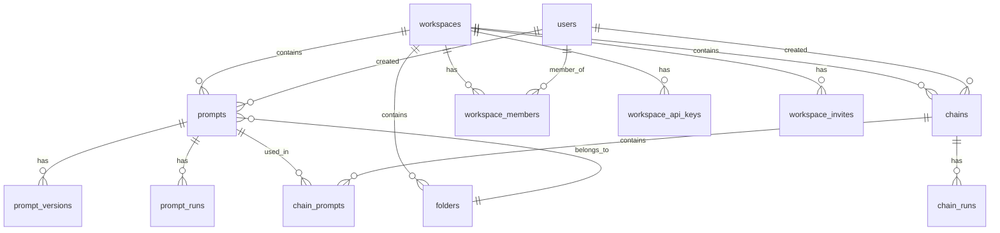

# 🗄️ ROCQET Database Schema
*Last Updated: 2025-08-24 - Added visibility field*
*Database: PostgreSQL (Supabase)*

## 📊 Complete Table Overview



---

## 📋 Table Definitions

### 1. **workspaces**
*Core workspace/organization entity*

| Column | Type | Constraints | Description |
|--------|------|------------|-------------|
| id | uuid | PRIMARY KEY | Auto-generated ID |
| name | varchar(255) | NOT NULL | Workspace display name |
| slug | varchar(255) | NOT NULL, UNIQUE | URL-friendly identifier |
| description | text | | Workspace description |
| logo_url | text | | Logo image URL |
| website | text | | Company website |
| subscription_tier | text | DEFAULT 'free' | Current tier (free/pro/enterprise) |
| subscription_status | text | DEFAULT 'active' | Status (active/cancelled/past_due) |
| trial_ends_at | timestamp | | Trial expiration date |
| created_by | uuid | NOT NULL | User who created workspace |
| created_at | timestamp | DEFAULT NOW() | Creation timestamp |
| updated_at | timestamp | DEFAULT NOW() | Last update timestamp |
| metadata | jsonb | DEFAULT {} | Extra workspace data |

**Indexes:**
- `workspaces_slug_key` (UNIQUE on slug)
- `workspaces_created_by_idx` (on created_by)

---

### 2. **prompts**
*AI prompt templates with versioning*

| Column | Type | Constraints | Description |
|--------|------|------------|-------------|
| id | uuid | PRIMARY KEY | Auto-generated ID |
| workspace_id | uuid | FOREIGN KEY → workspaces | Workspace owner |
| name | varchar(255) | NOT NULL | Prompt name |
| slug | varchar(255) | NOT NULL | URL-friendly identifier |
| description | text | | Prompt description |
| content | text | NOT NULL | Prompt template content |
| folder_id | uuid | FOREIGN KEY → folders | Parent folder (optional) |
| position | integer | DEFAULT 0 | Sort order in folder |
| variables | jsonb | DEFAULT [] | Template variables [{name, type, defaultValue}] |
| parameters | jsonb | DEFAULT {} | AI model parameters |
| model | varchar(100) | DEFAULT 'gpt-4' | Default AI model |
| temperature | integer | DEFAULT 7 | Temperature (0-20, divide by 10) |
| max_tokens | integer | | Max response tokens |
| version | integer | DEFAULT 1 | Current version number |
| is_published | boolean | DEFAULT false | Published status |
| published_at | timestamp | | Publication date |
| usage_count | integer | DEFAULT 0 | Times used |
| last_used_at | timestamp | | Last usage timestamp |
| average_rating | integer | | Rating (1-50, divide by 10) |
| when_to_use | text | | Usage documentation |
| example_input | jsonb | DEFAULT {} | Example input data |
| example_output | text | | Example output |
| requirements | jsonb | DEFAULT [] | Requirements list |
| warnings | jsonb | DEFAULT [] | Warning messages |
| related_prompts | jsonb | DEFAULT [] | Related prompt IDs |
| visibility | varchar | DEFAULT 'private' | Visibility (public/private) |
| is_shared | boolean | DEFAULT false | Shared with team |
| share_settings | jsonb | DEFAULT {} | Share configuration |
| tags | jsonb | DEFAULT [] | Tag array ["tag1", "tag2"] |
| metadata | jsonb | DEFAULT {} | Extra prompt data |
| created_by | uuid | NOT NULL | Creator user ID |
| updated_by | uuid | | Last editor user ID |
| created_at | timestamp | DEFAULT NOW() | Creation timestamp |
| updated_at | timestamp | DEFAULT NOW() | Last update timestamp |
| is_favorite | boolean | DEFAULT false | Favorite status |
| run_count | integer | DEFAULT 0 | Execution count |
| default_provider | varchar(50) | | Default AI provider (openai/anthropic/google) |
| default_max_tokens | integer | | Default max tokens setting |
| default_top_p | integer | DEFAULT 10 | Default top_p (*10 for precision) |
| default_frequency_penalty | integer | DEFAULT 0 | Default frequency penalty (*10) |
| default_presence_penalty | integer | DEFAULT 0 | Default presence penalty (*10) |

**Indexes:**
- `prompts_workspace_idx` (on workspace_id)
- `prompts_folder_idx` (on folder_id)
- `prompts_created_by_idx` (on created_by)
- `prompts_workspace_slug_unique` (on workspace_id, slug)
- `prompts_provider_idx` (on default_provider)

---

### 3. **prompt_versions**
*Git-style version history for prompts*

| Column | Type | Constraints | Description |
|--------|------|------------|-------------|
| id | uuid | PRIMARY KEY | Auto-generated ID |
| prompt_id | uuid | FOREIGN KEY → prompts | Parent prompt |
| workspace_id | uuid | FOREIGN KEY → workspaces | Workspace owner |
| version | integer | NOT NULL | Version number |
| content | text | NOT NULL | Prompt content at this version |
| variables | jsonb | DEFAULT [] | Variables at this version |
| parameters | jsonb | DEFAULT {} | Parameters at this version |
| change_type | varchar(50) | NOT NULL | Type (create/update/publish/revert) |
| change_message | text | | Commit message |
| diff | jsonb | | JSON Patch format diff |
| created_by | uuid | NOT NULL | User who made change |
| created_at | timestamp | DEFAULT NOW() | Version timestamp |

**Indexes:**
- `prompt_versions_prompt_idx` (on prompt_id)
- `prompt_versions_version_idx` (on prompt_id, version)

---

### 4. **folders**
*Hierarchical folder structure for prompts*

| Column | Type | Constraints | Description |
|--------|------|------------|-------------|
| id | uuid | PRIMARY KEY | Auto-generated ID |
| workspace_id | uuid | FOREIGN KEY → workspaces | Workspace owner |
| name | varchar(255) | NOT NULL | Folder name |
| description | text | | Folder description |
| parent_id | uuid | SELF REFERENCE | Parent folder (for nesting) |
| color | varchar(7) | | Hex color code |
| icon | varchar(50) | | Icon identifier |
| position | integer | DEFAULT 0 | Sort order |
| created_by | uuid | NOT NULL | Creator user ID |
| created_at | timestamp | DEFAULT NOW() | Creation timestamp |
| updated_at | timestamp | DEFAULT NOW() | Last update timestamp |

**Indexes:**
- `folders_workspace_idx` (on workspace_id)
- `folders_parent_idx` (on parent_id)

---

### 5. **chains**
*Workflow chains linking multiple prompts*

| Column | Type | Constraints | Description |
|--------|------|------------|-------------|
| id | uuid | PRIMARY KEY | Auto-generated ID |
| workspace_id | uuid | FOREIGN KEY → workspaces | Workspace owner |
| name | varchar(255) | NOT NULL | Chain name |
| slug | varchar(255) | NOT NULL | URL-friendly identifier |
| description | text | | Chain description |
| config | jsonb | DEFAULT {} | Chain configuration |
| is_active | boolean | DEFAULT true | Active status |
| run_count | integer | DEFAULT 0 | Execution count |
| last_run_at | timestamp | | Last execution timestamp |
| created_by | uuid | NOT NULL | Creator user ID |
| created_at | timestamp | DEFAULT NOW() | Creation timestamp |
| updated_at | timestamp | DEFAULT NOW() | Last update timestamp |

**Indexes:**
- `chains_workspace_idx` (on workspace_id)
- `chains_slug_idx` (on workspace_id, slug)

---

### 6. **chain_prompts**
*Junction table for prompts in chains*

| Column | Type | Constraints | Description |
|--------|------|------------|-------------|
| id | uuid | PRIMARY KEY | Auto-generated ID |
| chain_id | uuid | FOREIGN KEY → chains | Parent chain |
| prompt_id | uuid | FOREIGN KEY → prompts | Linked prompt |
| position | integer | NOT NULL | Order in chain |
| config | jsonb | DEFAULT {} | Step configuration |
| input_mapping | jsonb | DEFAULT {} | Input variable mapping |
| output_mapping | jsonb | DEFAULT {} | Output variable mapping |
| created_at | timestamp | DEFAULT NOW() | Creation timestamp |

**Indexes:**
- `chain_prompts_chain_idx` (on chain_id)
- `chain_prompts_position_idx` (on chain_id, position)

---

### 7. **workspace_members**
*Team members and their roles*

| Column | Type | Constraints | Description |
|--------|------|------------|-------------|
| id | uuid | PRIMARY KEY | Auto-generated ID |
| workspace_id | uuid | FOREIGN KEY → workspaces | Workspace |
| user_id | uuid | NOT NULL | User ID (from auth.users) |
| role | text | NOT NULL | Role (owner/admin/member/viewer) |
| permissions | jsonb | DEFAULT {} | Custom permissions |
| joined_at | timestamp | DEFAULT NOW() | Join timestamp |
| invited_by | uuid | | Inviter user ID |
| is_active | boolean | DEFAULT true | Active status |

**Indexes:**
- `workspace_members_workspace_idx` (on workspace_id)
- `workspace_members_user_idx` (on user_id)
- `workspace_members_unique` (UNIQUE on workspace_id, user_id)

---

### 8. **workspace_api_keys**
*API keys for AI providers*

| Column | Type | Constraints | Description |
|--------|------|------------|-------------|
| id | uuid | PRIMARY KEY | Auto-generated ID |
| workspace_id | uuid | FOREIGN KEY → workspaces | Workspace owner |
| provider | text | NOT NULL | Provider (openai/anthropic/etc) |
| api_key | text | NOT NULL | Encrypted API key |
| name | text | | Key nickname |
| is_active | boolean | DEFAULT true | Active status |
| last_used_at | timestamp | | Last usage timestamp |
| created_by | uuid | NOT NULL | Creator user ID |
| created_at | timestamp | DEFAULT NOW() | Creation timestamp |
| updated_at | timestamp | DEFAULT NOW() | Last update timestamp |

**Indexes:**
- `workspace_api_keys_workspace_idx` (on workspace_id)
- `workspace_api_keys_provider_idx` (on workspace_id, provider)

---

### 9. **workspace_invites**
*Pending team invitations*

| Column | Type | Constraints | Description |
|--------|------|------------|-------------|
| id | uuid | PRIMARY KEY | Auto-generated ID |
| workspace_id | uuid | FOREIGN KEY → workspaces | Workspace |
| email | text | NOT NULL | Invitee email |
| role | text | NOT NULL | Assigned role |
| token | text | NOT NULL, UNIQUE | Invitation token |
| expires_at | timestamp | NOT NULL | Expiration timestamp |
| accepted_at | timestamp | | Acceptance timestamp |
| created_by | uuid | NOT NULL | Inviter user ID |
| created_at | timestamp | DEFAULT NOW() | Creation timestamp |

**Indexes:**
- `workspace_invites_token_key` (UNIQUE on token)
- `workspace_invites_workspace_idx` (on workspace_id)

---

### 10. **share_links**
*Public/private share links for prompts*

| Column | Type | Constraints | Description |
|--------|------|------------|-------------|
| id | uuid | PRIMARY KEY | Auto-generated ID |
| workspace_id | uuid | FOREIGN KEY → workspaces | Workspace owner |
| prompt_id | uuid | FOREIGN KEY → prompts | Shared prompt |
| token | text | NOT NULL, UNIQUE | Share token |
| type | text | NOT NULL | Type (public/workspace/password) |
| password_hash | text | | Hashed password (if protected) |
| expires_at | timestamp | | Expiration date |
| view_count | integer | DEFAULT 0 | View counter |
| max_views | integer | | View limit |
| settings | jsonb | DEFAULT {} | Share settings |
| created_by | uuid | NOT NULL | Creator user ID |
| created_at | timestamp | DEFAULT NOW() | Creation timestamp |
| updated_at | timestamp | DEFAULT NOW() | Last update timestamp |

**Indexes:**
- `share_links_token_key` (UNIQUE on token)
- `share_links_prompt_idx` (on prompt_id)

---

### 11. **prompt_runs**
*Execution history for prompts*

| Column | Type | Constraints | Description |
|--------|------|------------|-------------|
| id | uuid | PRIMARY KEY | Auto-generated ID |
| prompt_id | uuid | FOREIGN KEY → prompts | Executed prompt |
| workspace_id | uuid | FOREIGN KEY → workspaces | Workspace |
| input | jsonb | NOT NULL | Input data |
| output | text | | AI response |
| model | text | NOT NULL | Model used |
| parameters | jsonb | DEFAULT {} | Parameters used |
| tokens_used | integer | | Token count |
| cost | decimal(10,4) | | Execution cost |
| duration_ms | integer | | Execution time (ms) |
| status | text | NOT NULL | Status (success/error/timeout) |
| error | text | | Error message if failed |
| created_by | uuid | NOT NULL | User who ran prompt |
| created_at | timestamp | DEFAULT NOW() | Execution timestamp |

**Indexes:**
- `prompt_runs_prompt_idx` (on prompt_id)
- `prompt_runs_workspace_idx` (on workspace_id)
- `prompt_runs_created_at_idx` (on created_at DESC)

---

### 12. **chain_runs**
*Execution history for chains*

| Column | Type | Constraints | Description |
|--------|------|------------|-------------|
| id | uuid | PRIMARY KEY | Auto-generated ID |
| chain_id | uuid | FOREIGN KEY → chains | Executed chain |
| workspace_id | uuid | FOREIGN KEY → workspaces | Workspace |
| input | jsonb | NOT NULL | Initial input |
| output | jsonb | | Final output |
| steps | jsonb | DEFAULT [] | Step-by-step results |
| total_tokens | integer | | Total tokens used |
| total_cost | decimal(10,4) | | Total cost |
| duration_ms | integer | | Total execution time |
| status | text | NOT NULL | Status (success/partial/error) |
| error | text | | Error message if failed |
| created_by | uuid | NOT NULL | User who ran chain |
| created_at | timestamp | DEFAULT NOW() | Execution timestamp |

**Indexes:**
- `chain_runs_chain_idx` (on chain_id)
- `chain_runs_workspace_idx` (on workspace_id)
- `chain_runs_created_at_idx` (on created_at DESC)

---

### 13. **tier_configurations**
*Subscription tier definitions*

| Column | Type | Constraints | Description |
|--------|------|------------|-------------|
| id | uuid | PRIMARY KEY | Auto-generated ID |
| name | text | NOT NULL, UNIQUE | Tier name (free/pro/enterprise) |
| display_name | text | NOT NULL | Display name |
| description | text | | Tier description |
| price_monthly | decimal(10,2) | | Monthly price |
| price_yearly | decimal(10,2) | | Yearly price |
| features | jsonb | NOT NULL | Feature list and limits |
| is_active | boolean | DEFAULT true | Active status |
| created_at | timestamp | DEFAULT NOW() | Creation timestamp |
| updated_at | timestamp | DEFAULT NOW() | Last update timestamp |

**Features JSON Structure:**
```json
{
  "prompts_limit": 10,
  "chains_limit": 5,
  "team_members_limit": 3,
  "api_keys_limit": 1,
  "storage_gb": 1,
  "support_level": "community",
  "features": ["basic_prompts", "folders"]
}
```

---

## 🔐 Row Level Security (RLS) Policies

### Key Policies:
1. **Workspace Isolation**: Users can only see data from their workspaces
2. **Role-Based Access**: Different permissions for owner/admin/member/viewer
3. **Public Data**: tier_configurations has NO RLS (public pricing)

### Example Policy Pattern:
```sql
-- Select policy for workspace members
CREATE POLICY "Users can view their workspace prompts"
  ON prompts FOR SELECT
  USING (
    workspace_id IN (
      SELECT workspace_id 
      FROM workspace_members 
      WHERE user_id = auth.uid()
    )
  );

-- Insert policy for members and above
CREATE POLICY "Members can create prompts"
  ON prompts FOR INSERT
  WITH CHECK (
    workspace_id IN (
      SELECT workspace_id 
      FROM workspace_members 
      WHERE user_id = auth.uid() 
      AND role IN ('owner', 'admin', 'member')
    )
  );
```

---

## 🔄 Common Queries

### Get user's workspaces:
```sql
SELECT w.*, wm.role
FROM workspaces w
JOIN workspace_members wm ON w.id = wm.workspace_id
WHERE wm.user_id = auth.uid()
AND wm.is_active = true;
```

### Get prompts with folder info:
```sql
SELECT p.*, f.name as folder_name
FROM prompts p
LEFT JOIN folders f ON p.folder_id = f.id
WHERE p.workspace_id = $1
ORDER BY p.updated_at DESC;
```

### Get chain with prompts:
```sql
SELECT c.*, 
  json_agg(
    json_build_object(
      'position', cp.position,
      'prompt', p.*
    ) ORDER BY cp.position
  ) as prompts
FROM chains c
LEFT JOIN chain_prompts cp ON c.id = cp.chain_id
LEFT JOIN prompts p ON cp.prompt_id = p.id
WHERE c.id = $1
GROUP BY c.id;
```

---

## 📝 Migration Notes

### Latest Changes:
- Added `is_favorite` and `run_count` to prompts
- Added `tags` as JSONB array (not separate table)
- Added workspace_api_keys for AI provider management
- Added share_links for sharing functionality
- Added tier_configurations for subscription management

### Pending Migrations:
- [ ] Add activity_logs table for audit trail
- [ ] Add prompt_templates for system prompts
- [ ] Add workspace_settings for preferences

---

## 🚨 Important Notes

1. **User IDs**: Reference Supabase auth.users table (not stored locally)
2. **Soft Deletes**: Consider adding `deleted_at` columns for soft delete
3. **Indexes**: Add more indexes based on query patterns
4. **JSONB Fields**: Use for flexible, schema-less data
5. **Timestamps**: Always include created_at/updated_at

---

## 🔍 Quick Lookup Commands

```bash
# Check table structure in psql
\d prompts

# List all tables
\dt

# Show indexes
\di

# Check RLS policies
\dp prompts
```