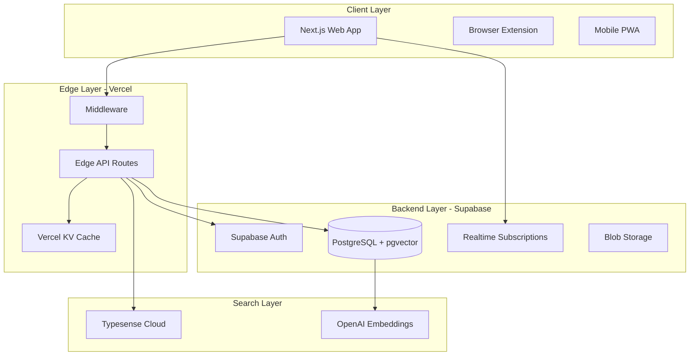

# 🏗️ ROCQET MASTER PLAN - Technical Architecture

## System Architecture Overview



## Tech Stack Decision Matrix

| Component | Choice | Why | Alternatives Considered |
|-----------|--------|-----|------------------------|
| **Framework** | Next.js 14 | Stable, Vercel-optimized, RSC support | Remix, SvelteKit |
| **Database** | Supabase PostgreSQL | Managed, real-time, pgvector support | PlanetScale, Neon |
| **ORM** | Drizzle | Edge-ready, type-safe, fast | Prisma, Kysely |
| **Search** | Typesense Cloud | Fast, typo-tolerant, faceted | Algolia, Meilisearch |
| **Cache** | Vercel KV | Native integration, global | Redis, Upstash |
| **Auth** | Supabase Auth | Integrated, supports SSO | Auth0, Clerk |
| **Real-time** | Supabase Realtime | Built-in, scales well | Pusher, Ably |
| **AI** | OpenAI + Anthropic | Best models, redundancy | Single provider |
| **Monitoring** | Sentry + Vercel Analytics | Complete observability | DataDog, New Relic |

## Database Architecture

### Core Schema (Drizzle)
```typescript
// Workspaces - The foundation
export const workspaces = pgTable('workspaces', {
  id: uuid('id').primaryKey().defaultRandom(),
  slug: text('slug').unique().notNull(),
  name: text('name').notNull(),
  type: workspaceType('type').notNull(), // personal | team | enterprise
  plan: subscriptionPlan('plan').notNull().default('free'),
  
  // Limits based on plan
  maxUsers: integer('max_users'),
  maxPrompts: integer('max_prompts'),
  maxStorageGb: integer('max_storage_gb'),
  
  // Metadata
  createdAt: timestamp('created_at').defaultNow(),
  updatedAt: timestamp('updated_at').defaultNow(),
});

// Prompts - Core entity
export const prompts = pgTable('prompts', {
  id: uuid('id').primaryKey().defaultRandom(),
  workspaceId: uuid('workspace_id').references(() => workspaces.id),
  slug: text('slug').notNull(),
  
  // Content
  title: text('title').notNull(),
  description: text('description'),
  content: text('content').notNull(),
  
  // AI Features
  embedding: vector('embedding', { dimensions: 1536 }), // For semantic search
  metadata: jsonb('metadata'), // Variables, model settings, etc.
  
  // Indexing
  searchVector: generatedColumn({
    as: sql`to_tsvector('english', title || ' ' || coalesce(description, '') || ' ' || content)`,
    type: 'tsvector',
    stored: true,
  }),
  
  // Tracking
  views: integer('views').default(0),
  copies: integer('copies').default(0),
  
  createdAt: timestamp('created_at').defaultNow(),
  updatedAt: timestamp('updated_at').defaultNow(),
  createdBy: uuid('created_by').references(() => users.id),
}, (table) => ({
  workspaceSlugUnique: unique().on(table.workspaceId, table.slug),
  searchIndex: index('search_idx').using('gin', table.searchVector),
  embeddingIndex: index('embedding_idx').using('ivfflat', table.embedding),
}));

// Git-Style Versioning
export const promptVersions = pgTable('prompt_versions', {
  id: uuid('id').primaryKey().defaultRandom(),
  promptId: uuid('prompt_id').references(() => prompts.id),
  parentVersionId: uuid('parent_version_id'), // For branching
  
  // Git-style storage
  diff: jsonb('diff').notNull(), // JSON Patch format
  snapshot: text('snapshot'), // Full content every 10 versions
  message: text('message'), // Commit message
  
  // Metadata
  version: integer('version').notNull(),
  branch: text('branch').default('main'),
  tags: text('tags').array(), // Version tags
  
  createdAt: timestamp('created_at').defaultNow(),
  createdBy: uuid('created_by').references(() => users.id),
});

// Real-time Collaboration
export const collaborationSessions = pgTable('collaboration_sessions', {
  id: uuid('id').primaryKey().defaultRandom(),
  promptId: uuid('prompt_id').references(() => prompts.id),
  
  // Session tracking
  activeUsers: jsonb('active_users'), // User presence data
  locks: jsonb('locks'), // Optimistic locking
  
  // Conflict resolution
  baseVersion: uuid('base_version').references(() => promptVersions.id),
  operations: jsonb('operations').array(), // Operational Transform
  
  expiresAt: timestamp('expires_at').notNull(),
});

// Audit Trail
export const auditLogs = pgTable('audit_logs', {
  id: uuid('id').primaryKey().defaultRandom(),
  workspaceId: uuid('workspace_id').references(() => workspaces.id),
  
  // Event data
  eventType: text('event_type').notNull(),
  resourceType: text('resource_type'),
  resourceId: uuid('resource_id'),
  
  // Actor
  userId: uuid('user_id').references(() => users.id),
  ipAddress: text('ip_address'),
  userAgent: text('user_agent'),
  
  // Details
  changes: jsonb('changes'),
  metadata: jsonb('metadata'),
  
  createdAt: timestamp('created_at').defaultNow(),
}, (table) => ({
  workspaceIdx: index().on(table.workspaceId, table.createdAt),
  userIdx: index().on(table.userId, table.createdAt),
}));
```

## API Architecture

### Edge Functions Pattern
```typescript
// api/prompts/[id]/route.ts
import { createEdgeHandler } from '@/lib/edge';

export const GET = createEdgeHandler({
  auth: true,
  cache: { revalidate: 60 },
  rateLimit: { requests: 100, window: '1m' },
  
  async handler(req, { params, user, workspace }) {
    // Automatic auth, caching, rate limiting
    const prompt = await getPrompt(params.id, workspace.id);
    return Response.json(prompt);
  }
});

// lib/edge.ts - Reusable wrapper
export function createEdgeHandler(options) {
  return async (req, context) => {
    // Auth check
    if (options.auth) {
      const user = await verifyAuth(req);
      if (!user) return unauthorized();
      context.user = user;
    }
    
    // Rate limiting
    if (options.rateLimit) {
      const limited = await checkRateLimit(req, options.rateLimit);
      if (limited) return tooManyRequests();
    }
    
    // Execute handler
    const response = await options.handler(req, context);
    
    // Add caching headers
    if (options.cache) {
      response.headers.set('Cache-Control', getCacheControl(options.cache));
    }
    
    return response;
  };
}
```

## Real-time Collaboration

### Operational Transform Implementation
```typescript
// Real-time collaborative editing
class CollaborationManager {
  private operations: Operation[] = [];
  private version: number = 0;
  
  async applyOperation(op: Operation, clientVersion: number) {
    // Transform against concurrent operations
    const transformed = this.transform(op, clientVersion);
    
    // Apply to document
    await this.applyToDocument(transformed);
    
    // Broadcast to other clients
    await this.broadcast(transformed);
    
    // Store for conflict resolution
    this.operations.push(transformed);
    this.version++;
  }
  
  transform(op: Operation, fromVersion: number): Operation {
    // OT algorithm for text
    let transformed = op;
    
    for (let i = fromVersion; i < this.version; i++) {
      transformed = transformOperation(transformed, this.operations[i]);
    }
    
    return transformed;
  }
}
```

## Search Architecture

### Multi-Layer Search Strategy
```typescript
// 1. Instant local search (cached)
const localResults = searchLocalCache(query);

// 2. Fast full-text search (Typesense)
const textResults = await typesense.search({
  q: query,
  query_by: 'title,content,description',
  facet_by: 'tags,folder',
  max_hits: 100,
});

// 3. Semantic search (pgvector)
const embedding = await openai.embeddings.create({
  model: 'text-embedding-ada-002',
  input: query,
});

const semanticResults = await db.execute(sql`
  SELECT * FROM prompts
  WHERE workspace_id = ${workspaceId}
  ORDER BY embedding <-> ${embedding} 
  LIMIT 20
`);

// 4. Merge and rank results
return mergeSearchResults(localResults, textResults, semanticResults);
```

## Security Architecture

### Defense in Depth
```yaml
Layer 1 - Network:
  - Cloudflare DDoS protection
  - Rate limiting at edge
  - IP allowlisting for enterprise

Layer 2 - Application:
  - JWT validation
  - CSRF tokens
  - Input sanitization
  - Output encoding

Layer 3 - Data:
  - Encryption at rest (AES-256)
  - Encryption in transit (TLS 1.3)
  - Field-level encryption for sensitive data

Layer 4 - Access:
  - Row-level security (RLS)
  - Attribute-based access control (ABAC)
  - Audit logging
```

### Enterprise SSO Integration
```typescript
// SAML 2.0 support
export async function handleSAMLCallback(req: Request) {
  const samlResponse = await parseSAMLResponse(req);
  
  // Verify with IdP
  const verified = await verifySAMLAssertion(samlResponse);
  
  // Create/update user
  const user = await upsertUser({
    email: verified.email,
    name: verified.name,
    ssoProvider: 'saml',
    metadata: verified.attributes,
  });
  
  // Create session
  return createSession(user);
}
```

## Performance Optimization

### Caching Strategy
```typescript
// Multi-level caching
const cache = {
  // L1: Browser cache (Service Worker)
  browser: {
    strategy: 'cache-first',
    ttl: 5 * 60, // 5 minutes
  },
  
  // L2: Edge cache (Vercel KV)
  edge: {
    strategy: 'stale-while-revalidate',
    ttl: 60 * 60, // 1 hour
  },
  
  // L3: Database cache (Materialized views)
  database: {
    strategy: 'background-refresh',
    ttl: 24 * 60 * 60, // 24 hours
  },
};
```

### Database Optimization
```sql
-- Materialized view for analytics
CREATE MATERIALIZED VIEW prompt_analytics AS
SELECT 
  p.id,
  p.workspace_id,
  COUNT(DISTINCT pv.id) as version_count,
  COUNT(DISTINCT ps.id) as share_count,
  SUM(p.views) as total_views,
  SUM(p.copies) as total_copies,
  AVG(pv.version) as avg_version
FROM prompts p
LEFT JOIN prompt_versions pv ON p.id = pv.prompt_id
LEFT JOIN prompt_shares ps ON p.id = ps.prompt_id
GROUP BY p.id, p.workspace_id
WITH DATA;

-- Refresh every hour
CREATE INDEX CONCURRENTLY ON prompt_analytics(workspace_id);
REFRESH MATERIALIZED VIEW CONCURRENTLY prompt_analytics;
```

## Deployment Architecture

### Infrastructure as Code
```yaml
# vercel.json
{
  "functions": {
    "api/**/*.ts": {
      "runtime": "edge",
      "maxDuration": 30
    }
  },
  "crons": [
    {
      "path": "/api/cron/analytics",
      "schedule": "0 * * * *"
    }
  ]
}

# Environment stages
environments:
  development:
    url: dev.rocqet.ai
    database: dev-db
    
  staging:
    url: staging.rocqet.ai
    database: staging-db
    
  production:
    url: rocqet.ai
    database: prod-db
    replicas: 3
```

## Monitoring & Observability

### Metrics to Track
```typescript
// Performance metrics
track('api.latency', { endpoint, duration });
track('db.query.time', { query, duration });
track('search.accuracy', { query, results });

// Business metrics
track('prompt.created', { workspace, user });
track('collaboration.session', { participants });
track('subscription.upgraded', { plan, mrr });

// Error tracking
Sentry.captureException(error, {
  user: { id: user.id },
  extra: { workspace: workspace.id },
});
```

## Scalability Plan

### Growth Stages
```yaml
Stage 1 (0-1K users):
  - Single database
  - Basic caching
  - Shared infrastructure

Stage 2 (1K-10K users):
  - Read replicas
  - CDN for assets
  - Dedicated search cluster

Stage 3 (10K-100K users):
  - Database sharding
  - Multi-region deployment
  - Custom infrastructure

Stage 4 (100K+ users):
  - Microservices architecture
  - Kubernetes orchestration
  - Global edge network
```

## Development Principles

1. **API-First**: Every feature has an API
2. **Real-time by Default**: Use websockets liberally
3. **Optimistic UI**: Update immediately, sync later
4. **Progressive Enhancement**: Works without JS
5. **Accessible**: WCAG 2.1 AA compliance
6. **Secure by Design**: Defense in depth
7. **Observable**: Metrics for everything
8. **Testable**: 80% coverage minimum

---

**This architecture is designed to scale from 0 to 100,000+ users without major rewrites.**

🚀 **Built for the future, shipping today!**