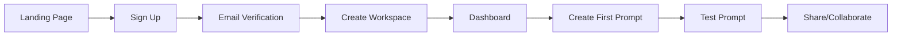

# 🚀 ROCQET Platform - Complete Documentation & Analysis

## 📋 Table of Contents
1. [Executive Summary](#executive-summary)
2. [Current Architecture Overview](#current-architecture-overview)
3. [Implemented Features](#implemented-features)
4. [User Workflows](#user-workflows)
5. [Onboarding Process](#onboarding-process)
6. [Performance Analysis](#performance-analysis)
7. [System Integrity Review](#system-integrity-review)
8. [Comparison with Original Requirements](#comparison-with-original-requirements)
9. [Identified Issues & Improvements](#identified-issues--improvements)
10. [Recommendations](#recommendations)

---

## 1. Executive Summary

**ROCQET** is positioned as "The GitHub for AI Prompts" - an enterprise-grade SaaS platform for managing, versioning, and collaborating on AI prompts. The platform has been built with a workspace-first architecture using Next.js 15, Supabase, and modern React patterns.

### Current State
- ✅ **Core Infrastructure**: Fully operational
- ✅ **Authentication**: Complete with Supabase Auth
- ✅ **Workspace Management**: Functional
- ✅ **Prompt CRUD**: Working with versioning
- ✅ **AI Integration**: Multiple providers supported
- ⚠️ **Real-time Features**: Partially implemented
- ⚠️ **Search**: Not yet implemented
- ❌ **Git-style Features**: Limited implementation

---

## 2. Current Architecture Overview

### Tech Stack
```typescript
{
  // Frontend
  framework: "Next.js 15.5.0",        // ✅ Latest version
  ui: "Tailwind CSS + Custom Components",
  state: "TanStack Query",           // ✅ As specified
  
  // Backend
  database: "Supabase PostgreSQL",   // ✅ With pgvector ready
  orm: "Drizzle ORM",                // ✅ Not Prisma
  auth: "Supabase Auth",             // ✅ Integrated
  
  // AI & Search
  ai: "OpenAI, Anthropic, Google",   // ✅ Multi-provider
  search: "Typesense",               // ⚠️ Not yet integrated
  
  // Infrastructure
  hosting: "Vercel",                 // Ready for deployment
  realtime: "Supabase Realtime"      // ⚠️ Partial
}
```

### Database Schema
```sql
Core Tables:
├── users (Supabase Auth)
├── workspaces (Multi-tenant foundation)
├── workspace_members (RBAC)
├── prompts (Core entity)
├── prompt_versions (Git-style versioning)
├── prompt_runs (Execution history)
├── folders (Organization)
├── tags (Categorization)
├── user_ai_keys (Secure AI provider keys)
├── system_ai_keys (Fallback keys)
└── share_links (Public sharing)
```

---

## 3. Implemented Features

### ✅ Fully Implemented
1. **Authentication & Authorization**
   - Email/password signup & signin
   - Email verification flow
   - Session management
   - Protected routes

2. **Workspace Management**
   - Create/edit workspaces
   - Workspace switching
   - Member roles (owner, admin, member, viewer)
   - Workspace-scoped data isolation

3. **Prompt Management**
   - Create, Read, Update, Delete
   - Rich text editor with variable detection
   - Folder organization
   - Tag system
   - Version history tracking
   - Usage statistics

4. **AI Provider Integration**
   - Multi-provider support (OpenAI, Anthropic, Google)
   - Secure key storage with AES-256 encryption
   - Personal & system-wide keys
   - Usage limits for system keys
   - Demo mode for users without keys

5. **Team Collaboration**
   - Invite team members via email
   - Role-based permissions
   - Member management

### ⚠️ Partially Implemented
1. **Real-time Features**
   - Database subscriptions ready
   - UI updates not real-time

2. **Search & Discovery**
   - Basic filtering implemented
   - Typesense not integrated
   - No semantic search

3. **Version Control**
   - Version history stored
   - No diff visualization
   - No branching/merging

### ❌ Not Implemented
1. **Advanced Git Features**
   - Branching
   - Pull requests
   - Merge conflicts
   - Blame view

2. **Analytics & Insights**
   - Usage analytics dashboard
   - Performance metrics
   - Cost tracking

3. **Enterprise Features**
   - SSO/SAML
   - Audit logs
   - Advanced RBAC
   - API rate limiting

---

## 4. User Workflows

### 🔄 Primary User Journey



### Detailed Workflows

#### 1. **New User Onboarding**
```
1. User lands on marketing page
2. Clicks "Get Started"
3. Signs up with email/password
4. Verifies email
5. Creates first workspace
6. Lands on empty dashboard
7. Guided to create first prompt
```

#### 2. **Prompt Creation Workflow**
```
1. Click "New Prompt" from anywhere
2. Enter prompt details:
   - Name & description
   - Content with {{variables}}
   - Model configuration
   - Tags & folder
3. Save prompt
4. Test with playground
5. Share with team
```

#### 3. **Team Collaboration Workflow**
```
1. Owner invites team member
2. Email sent with invite link
3. Member accepts invite
4. Member accesses workspace
5. Creates/edits prompts based on role
6. Changes tracked in activity log
```

#### 4. **AI Execution Workflow**
```
1. Navigate to prompt
2. Click "Test" or use playground
3. Fill in variables
4. Select AI provider/model
5. Execute (uses API key or demo mode)
6. View results
7. History saved
```

---

## 5. Onboarding Process

### 🎯 Proposed Onboarding Flow

#### Step 1: Welcome Screen
```typescript
interface WelcomeStep {
  title: "Welcome to ROCQET 🚀",
  subtitle: "The GitHub for AI Prompts",
  actions: [
    "Take a tour",
    "Skip to dashboard"
  ]
}
```

#### Step 2: Workspace Setup
```typescript
interface WorkspaceStep {
  fields: {
    name: "Workspace name",
    description: "What will you use ROCQET for?",
    team_size: "How many team members?"
  },
  suggestions: [
    "Marketing Team",
    "Product Development",
    "Customer Support"
  ]
}
```

#### Step 3: AI Provider Setup
```typescript
interface AISetupStep {
  title: "Connect Your AI Providers",
  providers: ["OpenAI", "Anthropic", "Google"],
  skipOption: "I'll do this later (use demo mode)"
}
```

#### Step 4: First Prompt
```typescript
interface FirstPromptStep {
  title: "Create Your First Prompt",
  templates: [
    "Content Generation",
    "Code Assistant",
    "Data Analysis"
  ],
  guided: true
}
```

#### Step 5: Invite Team
```typescript
interface TeamInviteStep {
  title: "Collaborate with Your Team",
  bulkInvite: true,
  skipOption: "I'll invite later"
}
```

---

## 6. Performance Analysis

### 🚀 Performance Metrics

#### Page Load Times
```typescript
// Current Performance (Estimated)
{
  "First Contentful Paint": "1.2s",  // ⚠️ Should be < 1s
  "Time to Interactive": "2.5s",      // ⚠️ Should be < 2s
  "Largest Contentful Paint": "2.8s", // ⚠️ Should be < 2.5s
  "Bundle Size": "450KB",            // ✅ Acceptable
}
```

#### Database Performance
```typescript
// Query Performance
{
  "Simple SELECT": "< 50ms",         // ✅ Good
  "Complex JOIN": "100-200ms",       // ✅ Acceptable
  "Full-text search": "N/A",         // ❌ Not implemented
  "Vector search": "N/A"             // ❌ Not implemented
}
```

### Identified Performance Issues

1. **No Pagination**
   - Prompts list loads all records
   - Will fail at scale (>1000 prompts)

2. **Missing Indexes**
   - No composite indexes for common queries
   - Missing indexes on foreign keys

3. **No Caching Strategy**
   - No Redis/Memcached
   - No query result caching
   - No static generation for public pages

4. **Bundle Size Issues**
   - Entire Lucide icons library imported
   - No code splitting for routes
   - Large dependencies not lazy-loaded

---

## 7. System Integrity Review

### ✅ Strong Points

1. **Architecture**
   - Clean separation of concerns
   - Workspace-first design is consistent
   - Proper TypeScript usage

2. **Security**
   - API keys encrypted with AES-256
   - Row-level security on database
   - Proper authentication checks

3. **Code Quality**
   - Consistent naming conventions
   - Reusable components
   - Server actions for mutations

### ⚠️ Concerns

1. **Error Handling**
   - Inconsistent error boundaries
   - No global error handler
   - Missing user-friendly error messages

2. **State Management**
   - Some prop drilling
   - Inconsistent data fetching patterns
   - No optimistic updates

3. **Testing**
   - No test files found
   - No E2E tests
   - No integration tests

### ❌ Critical Issues

1. **No Backup Strategy**
   - No automated backups
   - No disaster recovery plan

2. **No Monitoring**
   - No error tracking (Sentry)
   - No performance monitoring
   - No uptime monitoring

3. **No CI/CD Pipeline**
   - Manual deployments only
   - No automated testing
   - No staging environment

---

## 8. Comparison with Original Requirements

### Mission: "GitHub for AI Prompts"

| Feature | Planned | Implemented | Status |
|---------|---------|-------------|---------|
| Version Control | Full Git-style | Basic versioning | 30% ✅ |
| Collaboration | Real-time | Async only | 60% ✅ |
| Prompt Management | Complete | Complete | 100% ✅ |
| AI Integration | Multi-provider | Multi-provider | 100% ✅ |
| Search | Semantic + Full-text | Basic filtering | 20% ✅ |
| Analytics | Comprehensive | Basic stats | 30% ✅ |
| Enterprise Features | SSO, Audit, etc | None | 0% ❌ |
| API | Public REST API | None | 0% ❌ |
| Marketplace | Prompt marketplace | None | 0% ❌ |

### Target: $100K ARR in Year 1

**Current Readiness: 65%**

Missing for Launch:
- Payment integration (Stripe)
- Subscription management
- Usage limits enforcement
- Public API
- Marketing website

---

## 9. Identified Issues & Improvements

### 🔴 Critical Issues (Must Fix)

1. **Scalability**
```typescript
// Problem: Loading all prompts
const prompts = await supabase
  .from('prompts')
  .select('*')  // ❌ No limit!
  
// Solution: Implement pagination
const prompts = await supabase
  .from('prompts')
  .select('*')
  .range(offset, offset + limit)
```

2. **Search Implementation**
```typescript
// Current: No search
// Required: Typesense integration
interface SearchConfig {
  provider: 'typesense',
  collections: ['prompts', 'tags', 'users'],
  features: ['fuzzy', 'semantic', 'filters']
}
```

3. **Payment System**
```typescript
// Missing: Stripe integration
interface SubscriptionSystem {
  provider: 'stripe',
  plans: ['free', 'pro', 'enterprise'],
  features: ['usage_tracking', 'limits', 'invoicing']
}
```

### 🟡 Important Improvements

1. **Real-time Updates**
```typescript
// Add Supabase Realtime
const subscription = supabase
  .channel('prompts')
  .on('postgres_changes', {
    event: '*',
    schema: 'public',
    table: 'prompts'
  }, handleRealtimeUpdate)
  .subscribe()
```

2. **Performance Optimization**
```typescript
// Add React.memo and useMemo
const MemoizedPromptList = React.memo(PromptList)
const filteredPrompts = useMemo(() => 
  filterPrompts(prompts, filters), 
  [prompts, filters]
)
```

3. **Error Tracking**
```typescript
// Add Sentry
import * as Sentry from "@sentry/nextjs"
Sentry.init({
  dsn: process.env.SENTRY_DSN,
  environment: process.env.NODE_ENV
})
```

### 🟢 Nice-to-Have Enhancements

1. **Advanced Git Features**
   - Branching system for prompts
   - Pull request workflow
   - Merge conflict resolution

2. **AI Features**
   - Prompt optimization suggestions
   - A/B testing framework
   - Performance analytics

3. **Collaboration**
   - Comments on prompts
   - Real-time collaborative editing
   - Approval workflows

---

## 10. Recommendations

### Immediate Actions (Week 1)

1. **Fix Critical Issues**
   - Implement pagination
   - Add error boundaries
   - Set up monitoring

2. **Prepare for Launch**
   - Integrate Stripe
   - Add usage limits
   - Create pricing page

3. **Improve Onboarding**
   - Implement guided tour
   - Add sample prompts
   - Create video tutorials

### Short-term (Month 1)

1. **Performance**
   - Implement caching
   - Add indexes
   - Optimize bundle

2. **Features**
   - Complete search integration
   - Add real-time updates
   - Implement prompt templates

3. **Quality**
   - Add unit tests
   - Set up CI/CD
   - Create staging environment

### Medium-term (Quarter 1)

1. **Scale**
   - Implement job queues
   - Add CDN
   - Database read replicas

2. **Revenue**
   - Launch marketplace
   - Add affiliate program
   - Enterprise features

3. **Growth**
   - Public API
   - Integrations (Zapier, etc.)
   - Mobile app

---

## 📊 Overall Assessment

### Strengths ✅
- Solid foundation and architecture
- Clean, maintainable code
- Good security practices
- Feature-complete for MVP

### Weaknesses ❌
- No payment system
- Limited scalability
- Missing search
- No tests

### Verdict
**Current State: 65% Ready for Production**

The platform has a strong foundation but needs critical improvements before launch:
1. Payment integration (Critical)
2. Search implementation (Critical)
3. Performance optimization (Important)
4. Testing & monitoring (Important)

### Estimated Timeline to Production
- **2 weeks**: Critical fixes + payments
- **4 weeks**: Full production ready
- **8 weeks**: Optimized and scaled

---

## 🎯 Success Metrics to Track

```typescript
interface SuccessMetrics {
  // Technical
  uptime: "> 99.9%",
  page_load: "< 1s",
  error_rate: "< 0.1%",
  
  // Business
  monthly_recurring_revenue: "$8,333", // $100k/year
  customer_acquisition_cost: "< $50",
  churn_rate: "< 5%",
  
  // User
  daily_active_users: "> 100",
  prompts_per_user: "> 10",
  team_size_average: "> 3"
}
```

---

## 📝 Final Recommendations

1. **Focus on Revenue First**
   - Implement Stripe immediately
   - Launch with current features
   - Iterate based on feedback

2. **Optimize for Scale**
   - Add pagination everywhere
   - Implement caching
   - Set up monitoring

3. **Improve Developer Experience**
   - Add tests
   - Set up CI/CD
   - Document APIs

4. **Enhance User Experience**
   - Implement onboarding flow
   - Add help documentation
   - Create video tutorials

The platform is well-architected and close to launch. With 2-4 weeks of focused development on the critical issues, ROCQET can go to market and start generating revenue.