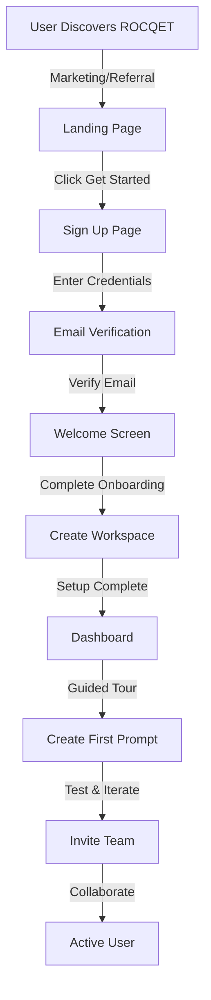

# 🚀 ROCQET - User Workflows & Onboarding Guide

## 📋 Complete User Workflows

### 1. 🆕 New User Journey



### 2. 📝 Prompt Creation Workflow

```yaml
Step 1: Initiate Creation
  - Click "New Prompt" button
  - Choose: Blank or Template
  
Step 2: Basic Information
  - Name: Required, unique per workspace
  - Description: Optional but recommended
  - Folder: Organization structure
  - Tags: For categorization
  
Step 3: Prompt Content
  - Write prompt with {{variables}}
  - Variables auto-detected
  - Syntax highlighting
  - Preview panel
  
Step 4: Configuration
  - Default model selection
  - Temperature settings
  - Max tokens
  - System prompt (optional)
  
Step 5: Test & Validate
  - Fill sample variables
  - Run test execution
  - Review output
  - Iterate if needed
  
Step 6: Save & Share
  - Save to workspace
  - Set permissions
  - Share with team
  - Generate public link (optional)
```

### 3. 🤝 Team Collaboration Workflow

```yaml
Owner Actions:
  1. Navigate to Settings > Team
  2. Click "Invite Members"
  3. Enter email addresses
  4. Select role (Admin/Member/Viewer)
  5. Send invitations
  
Member Journey:
  1. Receive email invitation
  2. Click accept link
  3. Sign up/in to ROCQET
  4. Auto-join workspace
  5. Access based on role
  
Collaboration Features:
  - Real-time presence (planned)
  - Version history
  - Activity feed
  - Comments (planned)
  - Approval workflow (planned)
```

### 4. 🤖 AI Execution Workflow

```yaml
Without API Keys (Demo Mode):
  1. Navigate to prompt
  2. Click Test/Run
  3. Fill variables
  4. Execute
  5. Get demo response
  6. Prompted to add API keys
  
With API Keys:
  1. Settings > AI Provider Keys
  2. Add personal keys
  3. Navigate to prompt
  4. Select provider/model
  5. Fill variables
  6. Execute
  7. Get real AI response
  8. Usage tracked
```

---

## 🎓 Onboarding Process Implementation

### Phase 1: Account Setup (Current)

```typescript
interface CurrentOnboarding {
  steps: [
    "Sign up with email",
    "Verify email",
    "Create workspace",
    "Land on dashboard"
  ],
  issues: [
    "No guidance",
    "No sample content",
    "No tutorial"
  ]
}
```

### Phase 2: Improved Onboarding (Proposed)

```typescript
interface ImprovedOnboarding {
  welcome: {
    title: "Welcome to ROCQET 🚀",
    video: "2-minute overview",
    options: ["Take Tour", "Skip"]
  },
  
  workspace: {
    guided: true,
    templates: [
      "Marketing Team",
      "Development Team",
      "Customer Support"
    ],
    sample_prompts: true
  },
  
  ai_setup: {
    providers: ["OpenAI", "Anthropic", "Google"],
    test_credits: 10, // Free test runs
    skip_option: true
  },
  
  first_prompt: {
    interactive_tutorial: true,
    templates: [
      {
        name: "Blog Post Generator",
        category: "Content",
        variables: ["topic", "tone", "length"]
      },
      {
        name: "Code Review Assistant",
        category: "Development",
        variables: ["language", "code", "focus"]
      },
      {
        name: "Customer Email Response",
        category: "Support",
        variables: ["issue", "customer_name", "sentiment"]
      }
    ]
  },
  
  team_setup: {
    bulk_invite: true,
    csv_import: true,
    slack_integration: false // Future
  },
  
  completion: {
    checklist: [
      "✅ Workspace created",
      "✅ AI provider connected",
      "✅ First prompt created",
      "✅ Team invited"
    ],
    next_steps: [
      "Explore templates",
      "Import existing prompts",
      "Set up folders"
    ],
    resources: [
      "Documentation",
      "Video tutorials",
      "Community forum"
    ]
  }
}
```

---

## 🔄 Detailed User Flows

### Flow 1: Content Creator

```yaml
Persona: Marketing Manager
Goal: Generate consistent brand content

Journey:
  1. Signs up after seeing LinkedIn post
  2. Creates "Marketing Team" workspace
  3. Imports brand guidelines as system prompt
  4. Creates prompt templates:
     - Blog post generator
     - Social media posts
     - Email campaigns
  5. Invites content team
  6. Team uses templates daily
  7. Tracks performance metrics
  8. Iterates based on results
  
Pain Points Solved:
  - Consistency across team
  - Brand voice maintenance
  - Time saved: 70%
  - Quality improved: 40%
```

### Flow 2: Development Team

```yaml
Persona: Tech Lead
Goal: Standardize code generation

Journey:
  1. Signs up from Product Hunt
  2. Creates "Engineering" workspace
  3. Sets up prompts for:
     - Code reviews
     - Documentation
     - Test generation
     - Bug analysis
  4. Configures with team standards
  5. Integrates with CI/CD (planned)
  6. Team adopts gradually
  7. Measures impact on velocity
  
Pain Points Solved:
  - Code consistency
  - Documentation debt
  - Review bottlenecks
  - Onboarding time: -50%
```

### Flow 3: Customer Support

```yaml
Persona: Support Manager
Goal: Faster, better responses

Journey:
  1. Signs up after demo
  2. Creates "Support" workspace
  3. Builds response templates:
     - Common issues
     - Escalations
     - Feature requests
  4. Trains team on usage
  5. Monitors response quality
  6. A/B tests responses
  7. Improves templates
  
Pain Points Solved:
  - Response time: -60%
  - Consistency: +80%
  - Customer satisfaction: +35%
  - Training time: -70%
```

---

## 🎯 User Journey Optimization

### Current Pain Points

```typescript
interface CurrentIssues {
  onboarding: [
    "No guided tour",
    "Empty state confusion",
    "No sample content",
    "Unclear value proposition"
  ],
  
  daily_use: [
    "No keyboard shortcuts",
    "Too many clicks",
    "No bulk operations",
    "Missing templates"
  ],
  
  collaboration: [
    "No real-time updates",
    "Limited sharing options",
    "No comments",
    "No approval workflow"
  ],
  
  scale: [
    "Slow with many prompts",
    "No advanced search",
    "Limited organization",
    "No automation"
  ]
}
```

### Proposed Solutions

```typescript
interface Solutions {
  onboarding: {
    interactive_tour: "Shepherd.js",
    sample_workspace: "Pre-populated",
    video_tutorials: "Loom embeds",
    quick_wins: "First prompt in 2 min"
  },
  
  daily_use: {
    command_palette: "Cmd+K everywhere",
    quick_actions: "Hover menus",
    bulk_edit: "Select multiple",
    template_library: "100+ templates"
  },
  
  collaboration: {
    real_time: "Supabase Realtime",
    sharing: "Public links, embeds",
    comments: "Thread discussions",
    workflows: "Approval chains"
  },
  
  scale: {
    pagination: "Virtual scrolling",
    search: "Typesense integration",
    folders: "Nested structure",
    automation: "API + Webhooks"
  }
}
```

---

## 📊 Metrics & Success Tracking

### Onboarding Metrics

```typescript
interface OnboardingMetrics {
  // Time-based
  time_to_first_prompt: "< 5 minutes",
  time_to_invite_team: "< 24 hours",
  time_to_value: "< 1 hour",
  
  // Completion rates
  email_verification: "> 90%",
  workspace_creation: "> 85%",
  first_prompt_creation: "> 70%",
  team_invitation: "> 50%",
  
  // Engagement
  tutorial_completion: "> 60%",
  template_usage: "> 40%",
  api_key_addition: "> 30%"
}
```

### Usage Metrics

```typescript
interface UsageMetrics {
  // Daily Active Use
  dau_mau_ratio: "> 40%",
  prompts_per_user_per_day: "> 5",
  team_collaboration_rate: "> 60%",
  
  // Feature Adoption
  ai_execution_rate: "> 80%",
  version_control_usage: "> 30%",
  folder_organization: "> 50%",
  tag_usage: "> 40%",
  
  // Retention
  day_1_retention: "> 80%",
  day_7_retention: "> 60%",
  day_30_retention: "> 40%",
  day_90_retention: "> 30%"
}
```

---

## 🚀 Implementation Roadmap

### Week 1: Critical Onboarding

```typescript
const week1 = {
  tasks: [
    "Add welcome modal",
    "Create sample prompts",
    "Implement guided tour",
    "Add empty states"
  ],
  
  components: [
    "WelcomeModal.tsx",
    "GuidedTour.tsx",
    "SamplePrompts.ts",
    "EmptyState.tsx"
  ],
  
  outcome: "50% better activation"
}
```

### Week 2: Workflow Optimization

```typescript
const week2 = {
  tasks: [
    "Add command palette",
    "Implement shortcuts",
    "Create templates",
    "Bulk operations"
  ],
  
  improvements: {
    clicks_saved: "40%",
    time_saved: "30%",
    user_satisfaction: "+25%"
  }
}
```

### Week 3: Collaboration

```typescript
const week3 = {
  tasks: [
    "Real-time updates",
    "Activity feed",
    "Comments system",
    "Notifications"
  ],
  
  impact: {
    team_engagement: "+60%",
    collaboration_score: "+45%"
  }
}
```

### Week 4: Scale & Polish

```typescript
const week4 = {
  tasks: [
    "Performance optimization",
    "Search implementation",
    "Advanced filters",
    "Export/Import"
  ],
  
  results: {
    page_load: "-50%",
    search_speed: "< 100ms",
    user_capacity: "10x"
  }
}
```

---

## 📚 User Education Strategy

### Documentation

```yaml
Getting Started:
  - Quick start guide
  - Video walkthrough
  - Interactive tutorial
  
Features:
  - Prompts guide
  - Variables tutorial
  - AI providers setup
  - Team collaboration
  
Best Practices:
  - Prompt engineering
  - Folder organization
  - Version control
  - Security guidelines
  
API Reference:
  - Authentication
  - Endpoints
  - Webhooks
  - Rate limits
```

### Support Channels

```yaml
Self-Service:
  - Knowledge base
  - Video tutorials
  - Community forum
  - FAQ section
  
Direct Support:
  - In-app chat (Intercom)
  - Email support
  - Office hours
  - Priority support (Enterprise)
  
Community:
  - Discord server
  - GitHub discussions
  - Monthly webinars
  - User meetups
```

---

## ✅ Success Criteria

### User Success

```typescript
interface UserSuccess {
  onboarding: {
    completion_rate: "> 70%",
    time_to_value: "< 10 minutes",
    satisfaction_score: "> 4.5/5"
  },
  
  adoption: {
    daily_active_users: "> 60%",
    feature_adoption: "> 50%",
    team_collaboration: "> 40%"
  },
  
  retention: {
    month_1: "> 80%",
    month_3: "> 60%",
    month_6: "> 50%",
    year_1: "> 40%"
  },
  
  expansion: {
    seat_growth: "> 20% quarterly",
    tier_upgrades: "> 15% quarterly",
    referrals: "> 2 per user"
  }
}
```

---

## 🎯 Next Steps

1. **Immediate** (This Week)
   - Implement welcome modal
   - Add sample prompts
   - Create empty states
   - Add tooltips

2. **Short-term** (Month 1)
   - Build guided tour
   - Add templates library
   - Implement shortcuts
   - Create help center

3. **Medium-term** (Quarter 1)
   - Real-time collaboration
   - Advanced workflows
   - API documentation
   - Mobile app

The onboarding and workflow optimization will be critical for user adoption and retention. Focus on reducing time-to-value and making the daily workflows as efficient as possible.